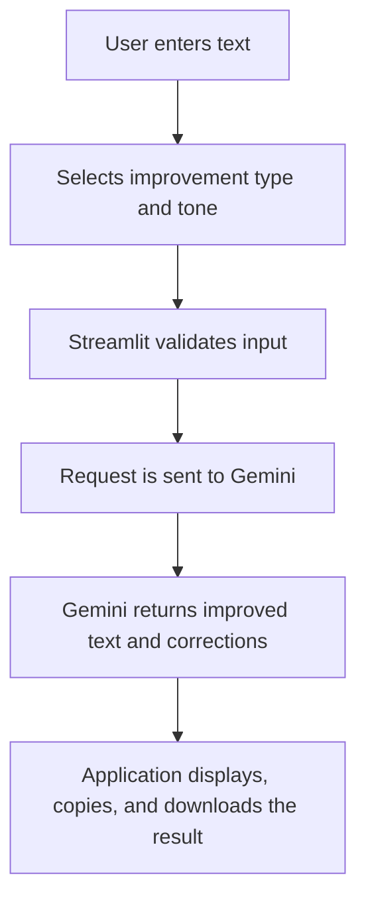
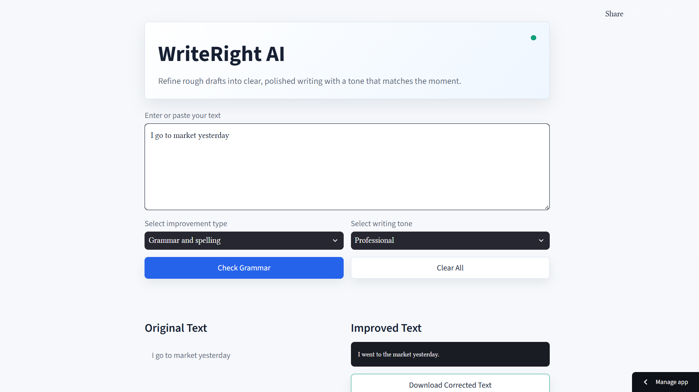
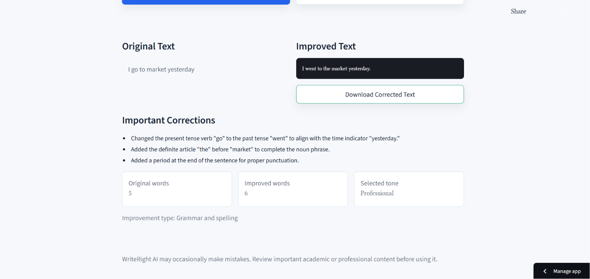

# WriteRight AI ✍️

**A Generative AI-powered grammar checker and writing improvement assistant.**

WriteRight AI helps users correct grammar, spelling, punctuation, and capitalization errors while also improving clarity, simplifying text, shortening text, rewriting content professionally, and adapting writing to different tones.

## Project Overview

WriteRight AI is a Python and Streamlit web application that uses the Google Gemini API to analyze user-provided text and generate a polished version. The application is designed for students, professionals, and general users who want quick writing assistance through a clean and responsive interface.

The app allows users to paste text, choose an improvement type, select a writing tone, and receive an improved version with important correction explanations and word count comparison.

## Problem Statement

Many users struggle with writing clear, grammatically correct, and tone-appropriate content for academic, professional, and everyday communication. Manual proofreading can be time-consuming, and simple rule-based grammar tools may not fully understand context, tone, or rewriting intent.

## Proposed Solution

WriteRight AI provides an AI-assisted writing correction system powered by Gemini. Instead of only highlighting errors, the application generates a complete improved version of the text and explains the most important corrections. It also lets users choose the type of improvement and desired tone, making the output more useful for different writing situations.

## Main Features

- Large text input area for writing or pasting content
- Grammar and spelling correction
- Punctuation and capitalization correction
- Sentence clarity improvement
- Professional rewriting
- Text simplification
- Text shortening
- Writing tone selection:
  - Professional
  - Formal
  - Friendly
  - Academic
  - Casual
  - Polite
- Original and improved text comparison
- Copy-to-clipboard icon for improved text
- Download improved text as a `.txt` file
- Important correction explanations
- Original and improved word counts
- Clear All button
- Empty-input validation
- Gemini API error handling
- Streamlit Session State for preserving generated results
- Responsive two-column interface
- Custom UI styling

## Technology Stack

- Python 3.12
- Streamlit
- Google Gemini API
- `google-genai` Python SDK
- `python-dotenv`
- Git and GitHub
- Streamlit Community Cloud for deployment

## Application Workflow



## Project Structure

```text
writeright-ai/
├── app.py
├── requirements.txt
├── .env
├── .gitignore
└── README.md
```

## Prerequisites

Before running the project locally, make sure you have:

- Python 3.12 installed
- Git installed
- A Google Gemini API key
- A code editor such as Visual Studio Code
- Windows PowerShell

## Local Installation Instructions

Clone the repository or download the project folder:

```powershell
git clone [Add GitHub repository link]
cd writeright-ai
```

If you already have the project folder locally, open Windows PowerShell inside the `writeright-ai` directory.

## Virtual Environment Setup for Windows PowerShell

Create a virtual environment:

```powershell
python -m venv .venv
```

Activate the virtual environment in PowerShell:

```powershell
Set-ExecutionPolicy -Scope Process -ExecutionPolicy Bypass
.\.venv\Scripts\Activate.ps1
```

After activation, the terminal should show `(.venv)` before the command prompt.

## Package Installation

Install all required dependencies:

```powershell
python -m pip install -r requirements.txt
```

The `requirements.txt` file includes:

```text
streamlit
google-genai
python-dotenv
```

## Gemini API Key Setup

WriteRight AI requires a Gemini API key to send text improvement requests to Google's Generative AI model.

General steps:

1. Go to Google AI Studio.
2. Sign in with your Google account.
3. Create or copy a Gemini API key.
4. Store the key locally in a `.env` file.

Do not paste your real API key directly into `app.py`, `README.md`, screenshots, commits, or public messages.

## Creating the `.env` File

Create a file named `.env` in the project root:

```text
writeright-ai/.env
```

Add the following environment variable:

```env
GEMINI_API_KEY=your_gemini_api_key_here
```

Important: the `.env` file must never be uploaded to GitHub because it contains private credentials. Make sure `.env` is listed in `.gitignore`.

## Running the Streamlit Application

Run the application from the project root:

```powershell
python -m streamlit run app.py
```

Streamlit will start a local development server and show a local URL in the terminal, usually:

```text
http://localhost:8501
```

Open the URL in your browser to use WriteRight AI.

## Example Input and Expected Output

Example input:

```text
I has completed my assignment yesterday but i forget to submit it.
```

Expected corrected output:

```text
I completed my assignment yesterday, but I forgot to submit it.
```

Example correction explanation:

```text
- Changed "has completed" to "completed" for correct past tense usage.
- Capitalized "I".
- Changed "forget" to "forgot" to match the past time reference.
- Added a comma before "but" to improve punctuation.
```

## Testing Checklist

Use this checklist to verify the application before submission or deployment:

- The app starts successfully with `python -m streamlit run app.py`
- The text area accepts long input
- Empty input shows a validation warning
- Very short input shows a validation warning
- Grammar and spelling correction works
- Clarity improvement works
- Professional rewriting works
- Text simplification works
- Text shortening works
- All tone options are visible
- Original and improved text appear side by side
- Copy-to-clipboard icon appears for improved text
- TXT download button downloads the improved text
- Important correction explanations are displayed
- Original and improved word counts are shown
- Clear All resets input and generated output
- Invalid or missing Gemini API key shows an error message
- The layout remains usable on smaller screens
- No real API key is committed to GitHub

## Deployment Instructions for Streamlit Community Cloud

To deploy WriteRight AI on Streamlit Community Cloud:

1. Push the project to a GitHub repository.
2. Make sure `requirements.txt` is present in the repository root.
3. Make sure `.env` is not uploaded to GitHub.
4. Go to Streamlit Community Cloud.
5. Sign in with GitHub.
6. Select the GitHub repository for this project.
7. Set the main file path as:

```text
app.py
```

8. Add the required environment variable in Streamlit secrets.
9. Deploy the application.

## Environment Variable Setup During Deployment

In Streamlit Community Cloud, add the Gemini API key under:

```text
App settings → Secrets
```

Use this secrets format:

```toml
GEMINI_API_KEY = "your_gemini_api_key_here"
```

Do not upload `.env` to GitHub. Streamlit Community Cloud should use its Secrets setting instead.

## Security Notes

- Never commit `.env` to GitHub.
- Never expose the Gemini API key in screenshots, README files, public repositories, or demo videos.
- Rotate the API key if it is accidentally exposed.
- Use Streamlit Secrets for deployed applications.
- Review AI-generated writing before using it for important academic, legal, or professional work.

## Known Limitations

- Output quality depends on the Gemini model response.
- The application requires an active internet connection.
- API requests may fail if the API key is invalid, expired, missing, or rate-limited.
- AI-generated corrections may occasionally be inaccurate.
- The app currently focuses on text-based writing improvement only.
- It does not currently store user history or support account-based usage.

## Future Improvements

- Add support for multiple languages
- Add document upload support for `.txt`, `.docx`, and `.pdf`
- Add grammar issue highlighting inside the original text
- Add user history for previous corrections
- Add side-by-side diff highlighting
- Add export options for PDF and DOCX
- Add more tone presets
- Add custom tone instructions
- Add authentication for personal dashboards
- Add automated tests for input validation and response parsing

## Screenshots

Add screenshots in the `docs/screenshots/` folder and update the image paths if needed.

### Home Page



### Result Page



## Live Demo and GitHub Repository

- Live demo: [Add live demo link]
- GitHub repository: [Add GitHub repository link]

## License

[Add license information]

If this project is submitted for academic purposes, confirm the required license or submission policy with your institution before publishing it publicly.

## Acknowledgements

- Streamlit for the web application framework
- Google Gemini API for Generative AI text improvement
- `google-genai` for Gemini API access in Python
- `python-dotenv` for local environment variable management
- Project mentors, instructors, and reviewers for guidance

## Contact

- Group leader: [Add group leader name]
- Email: [Add contact email]
- Institution/Class: [Add institution or course name]
